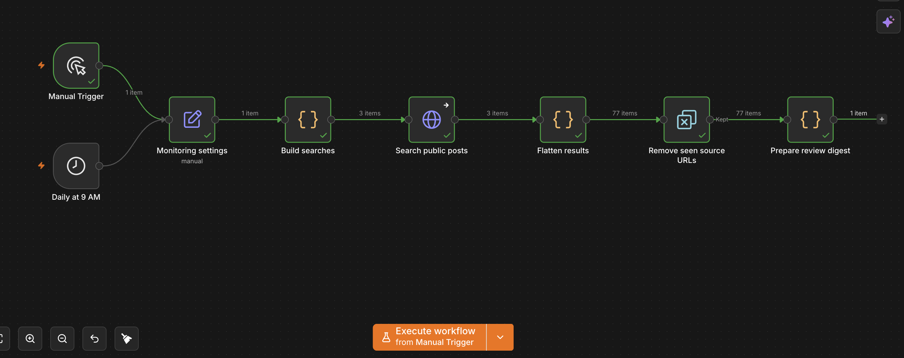
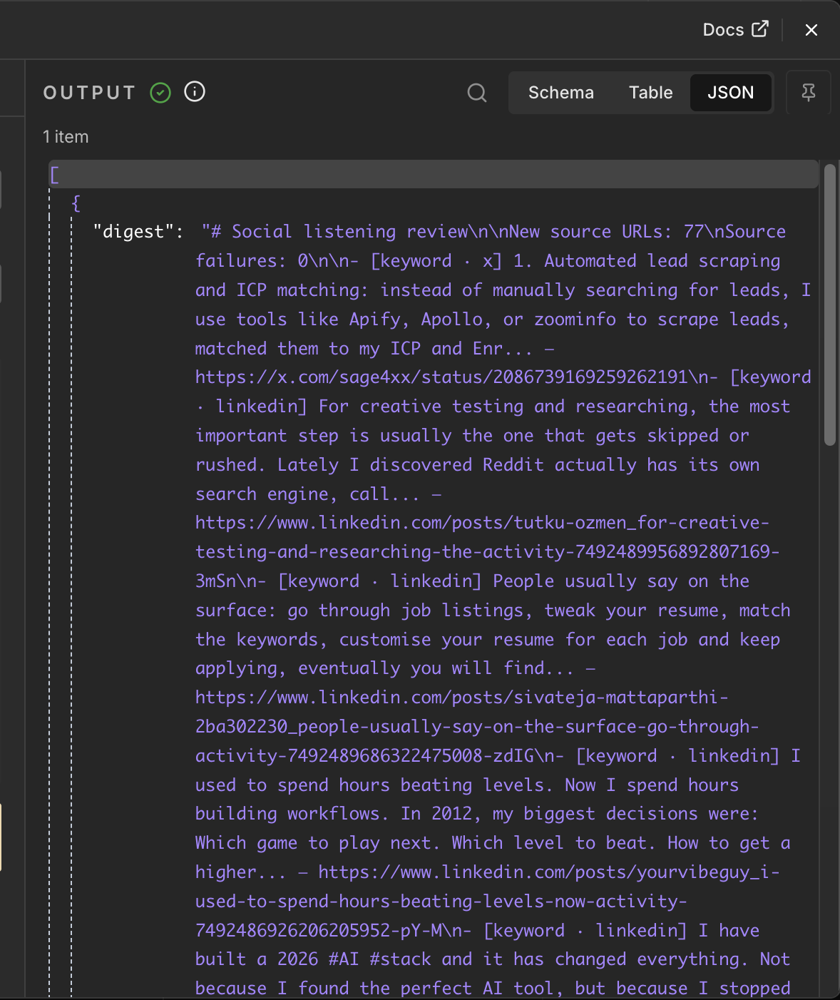
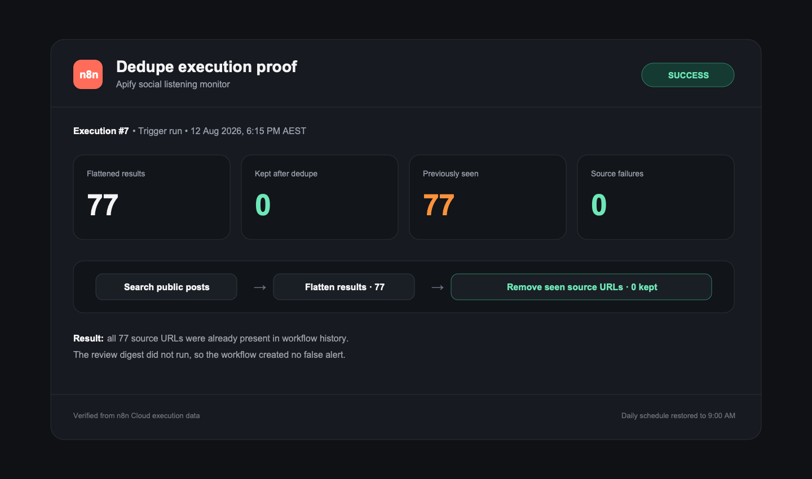

# SocialListeningAPI examples for marketers

People talk about your brand and competitors across different networks. Checking each network
by hand is slow, and broad searches create noisy reports. This repository gives you one working
starting point: search LinkedIn, X, and Reddit for one brand and one competitor, remove URLs you
have already seen, then prepare a sourced review digest.

Allow about 10 minutes for the JavaScript or OpenClaw example. The n8n workflow usually takes
about 20 minutes because you must add credentials, choose a timezone, and connect Slack if you
want delivery.

## What one run costs

| Public search | Route | Credits |
| --- | --- | ---: |
| LinkedIn posts | `/api/v1/linkedin/search` | 2 |
| X posts | `/api/v1/x/search` | 1 |
| Reddit posts | `/api/v1/reddit/search-posts` | 1 |

One query across all three sources costs 4 credits. A brand query plus a competitor query costs
8 credits when all six requests succeed. SocialListeningAPI uses one-time credit packs, and
credits do not expire.

## Real Apify example

On August 10, 2026, the n8n workflow searched `apify` across LinkedIn, X, and Reddit. It returned
77 new source URLs, used 4 credits, and reported 0 source failures. Results change as public posts
change. Review each source before using it in marketing work.





## Dedupe proof

On August 12, 2026, n8n execution #7 returned 77 source URLs. The workflow kept 0 and
discarded all 77 as previously seen. It reported 0 source failures and did not create an empty
digest. This proof run used 4 credits.



## Start here

1. Create an account at [SocialListeningAPI](https://sociallisteningapi.com) and copy your API
   key.
2. Choose the example that matches your current tool:
   - `openclaw/` for an installable agent skill;
   - `n8n/` for a scheduled, no-LLM review workflow;
   - `mcp/` for manual research prompts;
   - `javascript-agent/` for a dependency-free Node example.
3. Add the key through an environment variable or your tool's credential store. Never paste it
   into a script, prompt, or exported workflow.
4. Replace the example brand and competitor names.
5. Run once manually and review the source links before adding a schedule.

## What the API does

SocialListeningAPI searches public data and returns normalized results. It provides one API key
and one response structure across the sources used here.

Scheduling, stored history, deduplication, classification, Slack delivery, and alerts happen in
OpenClaw, n8n, your JavaScript application, or another external tool. They are not native API
features. Results can be incomplete or irrelevant. A marketer should review each source before
replying, reporting, or making a decision.

## Examples

### OpenClaw

Install the local skill from this repository:

```bash
openclaw skills install ./openclaw/social-listening-monitor
```

Set `SOCIALLISTENING_API_KEY` in the OpenClaw process environment. The skill passes search input
through environment values and uses a fixed command, so query text is never placed in a shell
command.

### n8n

Import `n8n/brand-competitor-monitor.json`, then follow `n8n/README.md`. The workflow runs
manually or every day at 9:00 AM, remembers up to 10,000 source URLs, prepares a short digest,
and has a disabled Slack step ready for your credential and channel.

### MCP

Use the copyable prompts in `mcp/README.md` with an MCP tool that can make authenticated HTTP
requests. This is for manual research. It does not create a schedule or stored monitoring state.

### JavaScript

```bash
cd javascript-agent
SOCIALLISTENING_API_KEY=your_key node index.js "YOUR_BRAND" linkedin,x,reddit
```

The module exports `searchConversations(query, platforms)` for reuse in an agent or internal
marketing tool.

## Tested versions

- Node.js 24.14.0
- OpenClaw 2026.6.1
- n8n 2.33.7

No Make example is included. Add one only after exporting and validating a real Make scenario.
